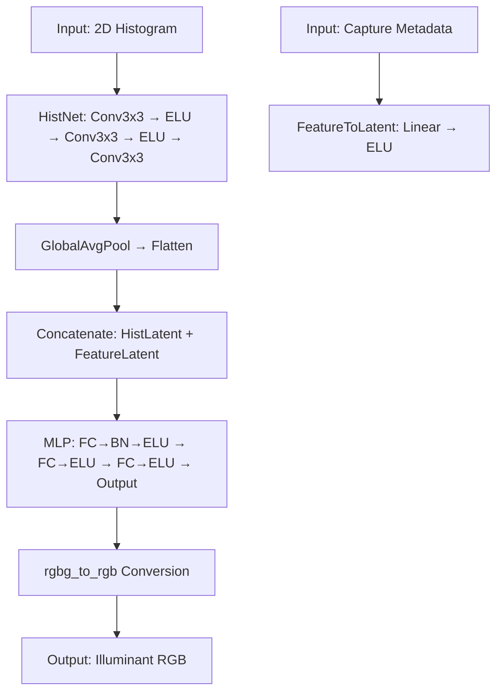
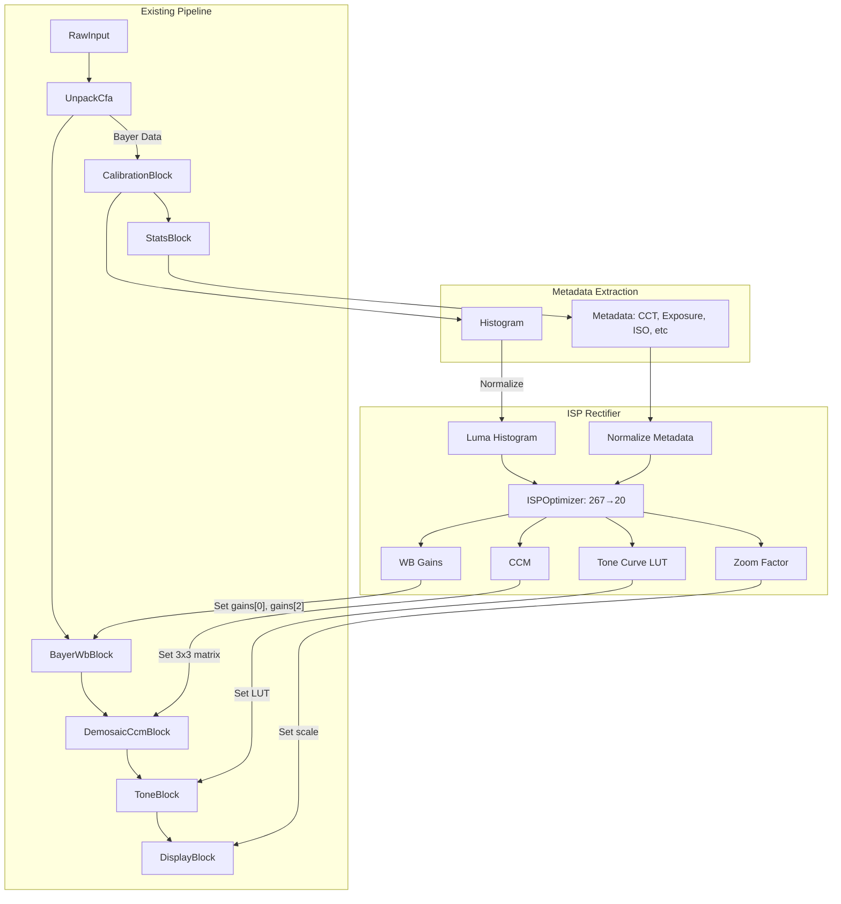

# ISP Teacher Models - Analysis and Integration Guide

This document analyzes the existing teacher models (Time-Aware AWB and CCMNet) used for distillation, and provides integration guidance for using the resulting student model in the softisp pipeline.

## 📚 Overview

| Model | Purpose | Input | Output | Architecture |
|-------|---------|-------|--------|--------------|
| **Time-Aware AWB** | Auto White Balance with temporal awareness | 2D histogram (256×4) + metadata (15-21 dim) | Illuminant RGB (→ WB gains) | CNN + MLP |
| **CCMNet** | Color Correction Matrix prediction | Chroma/image histograms + CM1/CM2 | Illuminant UV (→ CCM) | U-Net with CFE |
| **Student Model** | Distilled neural controller combining AWB+CCM+tone+zoom | 256-bin histogram + 11-dim metadata | WB gains + CCM + tone curve + zoom | MLP + 1D CNN |

## 🔍 Time-Aware AWB Detailed Analysis

### Input Interface

| Input Component | Dimensions | Source | Description | Normalization |
|-----------------|------------|--------|-------------|---------------|
| **2D Histogram** | 256×4 bins | Raw image statistics | RGGB histogram computed from Bayer raw | Min-max normalized by histogram bounds |
| **Capture Metadata** | 15 dim (base) + 6 (SNR) + preference | JPEG/EXIF/API | Camera/scene metadata including time info | Min-max normalized per feature |

**Capture Metadata Components:**
- `iso` | Log(ISO) | Sensor setting
- `shutter_speed` | Log(shutter speed) | Exposure time
- `flash` | Binary | Flash fired
- `snr_stats` | 6 dim | Mean/std of R,G,B noise patches
- `time` | 6 dim | [sunrise_prob, sunset_prob, ..., midnight_prob]
- `is_before` | 6 dim | [is_before_sunrise, ..., is_before_midnight] binary flags

`metadata_size = 15 + (6 if args.snr_stats else 0) + (preference features)`

### Processing Algorithm



**Key Operations:**
1. `HistNet`: Processes 2D RGGB histogram with 3×Conv3x3 layers + ELU activations
2. `FeatureToLatent`: Projects capture metadata to latent space
3. `FC Layers`: Combines histogram+metadata features through 3×MLP layers with BN/ELU
4. `rg_bg_to_illum_rgb`: Converts network output to RGB illuminant using:
   ```python
def rg_bg_to_illum_rgb(rg_bg):
    g = rg_bg.sum(dim=-1, keepdim=True) / 3
    r = rg_bg[..., 0:1] + g
    b = rg_bg[..., 1:2] + g
    return torch.cat([r, g, b], dim=-1)
```

### Output Interface

| Output | Dimensions | Usage | Format |
|--------|------------|-------|--------|
| **Illuminant RGB** | [R,G,B] (3) | Converted to WB gains: `illum_rgb / illum_rgb.g` | Float [0, inf], typically [0.5,2.5] |

**WB Gains Calculation:**
```python
# From demo.py
def get_wb_gains(illum_rgb):
    gains = illum_rgb / illum_rgb[1]  # Normalize by G
    gains[isnan(gains)] = 1.0  # Handle NaN
    return gains.clamp(0.1, 3.0)  # Clamp to safe range
```

## 🎨 CCMNet Detailed Analysis

### Input Interface

| Input Component | Dimensions | Source | Description | Normalization |
|-----------------|------------|--------|-------------|---------------|
| **Model Input N** | B×1×(4+CFE)×H×W | Constructed from histogram + coordinates | Includes: 
- 2-channel histogram (chroma+edge)
- UV coordinates
- CFE features | Coordinate-dependent |
| **ColorMatrixCM1** | B×9 | Camera sensor | First color matrix from DNG | Reshaped to 3×3 |
| **ColorMatrixCM2** | B×9 | Camera sensor | Second color matrix from DNG | Reshaped to 3×3 |

**CFE (Color Filter Enhancement) Features:**
- Extracted from linear weights blending of CM1/CM2 across CCT grid
- Computed via `get_illum_hist()` method with differentiable histogram
- Encoded through 4-layer CNN → flattened → projection head

### Processing Algorithm

```mermaid
flowchart TD
    A[Input: CM1+CM2] --> B[get_illum_hist: DiffHist over CCT grid]
    B --> C[CFE Encoder: Conv → Project]
    C --> D[CFE Features]
    E[Input: Histogram] --> F[UV Coordinates]
    D --> G[Concatenate Hists + UV + CFE]
    G --> H[Encoder: 4×(ConvBlock → MaxPool)]
    H --> I[Bottleneck: DoubleConvBlock]
    I --> J[Decoder_B: Upsample → Skip → Conv → Output B]
    I --> K[Decoder_F: Upsample → Skip → Conv → Output F]
    J --> L[Conv(F) * FFT(N) + B]
    L --> M[Softmax to Probability Map P]
    M --> N[UV to xy: u,v = Σ(P * coord)]
    N --> O[xy_to_rgb: Output Illuminant UV → RGB]
```

**Key Operations:**
1. `get_illum_hist`: Computes differentiable histogram over CCT grid from CM1/CM2 interpolation
2. `CFE Encoder`: Extracts 8-dimensional CFE features via 4-layer CNN
3. `Encoder`: Processes concatenated histograms + UV + CFE with 4×ConvBlocks
4. `Bottleneck`: Standard convolutional bottleneck
5. `Decoder_B/F`: Separate branches for bias/filters (UNet with skip connections)
6. **Frequency Domain Convolution**: `FFT(N) * FFT(F)` for efficient filtering
7. `Softmax`: Converts to probability map over UV coordinates

### Output Interface

| Output | Dimensions | Usage | Format |
|--------|------------|-------|--------|
| **Illuminant RGB** | [R,G,B] (3) | → CCM via Bradford adaptation | Float [0,1] |
| **P (Probability Map)** | H×W | Visualization of estimated illuminant | Float [0,1] |
| **F (Filter)** | B×2×K×K | Internal filter for histogram processing | Complex-valued |
| **B (Bias)** | B×H×W | Internal bias map | Float |

**CCM Calculation:**
1. Convert XY illuminant coordinates to RGB via `uv_to_rgb`
2. Compute Bradford-adapted CCM using:
```python
# From colour-science library
def chromatic_adaptation(source_rgb, target_rgb, adaptation_method):
    """Compute adapted CCM: source_rgb → XYZ → target_rgb adapt → new CCM"""
    # Uses Bradford cone response matrix
    pass
```

## 🧩 Student Model Integration Guide

### Input Requirements (267-dim vector)

| Component | Size | Source in PIPELINE_BLOCKS.md | Notes |
|-----------|------|-------------------------------|-------|
| **Luma Histogram** | 256 | Computed from Bayer stats (CalibrationBlock) | Normalize sum=10,000 |
| **CCT** | 1 | Derived from AWB or sensor | /10,000 for [0,1] |
| **WB Gains** | 3 | Current WB (BayerWbBlock) | [R,G,B] raw gains |
| **Exposure** | 1 | Sensor shutter time | Raw seconds |
| **ISO** | 1 | Sensor ISO | Raw multiplier |
| **Focus** | 1 | Autofocus system | [0,1] position |
| **Sharpness** | 1 | Focus statistics | [0,1] metric |
| **Brightness** | 1 | Luma mean | [0,1] normalized |
| **Contrast** | 1 | Luma standard deviation | [0,1] normalized |
| **Noise Level** | 1 | Noise estimation | [0,0.3] |

**Normalization Equations:**
```python
# Example normalization functions
normalize_histogram(histogram) → histogram / sum(histogram) * 10,000
normalize_cct(cct) → cct / 10000.0
normalize_wb_gain(gain) → gain  # Already normalized around 1.0
exposure_time_norm = min(exposure_time, 0.1) / 0.1
iso_norm = log2(iso) / log2(16000)
```

### Output Interface

| Output | Dimensions | Target Block | Transformation |
|--------|------------|--------------|----------------|
| **WB Gains** | [3] | BayerWbBlock | `[wb_r, 1.0, wb_b`] (keep G=1.0 reference) |
| **CCM Matrix** | [9] | CcmBlock | Reshape to 3×3 row-major, clamp to [-3,3] |
| **Tone Curve** | [7] | ToneBlock | Piecewise linear LUT: `[0, 1/6, 2/6, ..., 1]` |
| **Zoom Factor** | [1] | Scale Blocks | Multiplicative factor, clamp to [1.0,4.0] |

### Integration Code Snippets

#### 1. Rust: Metadata Extraction
```rust
// After CalibrationBlock (in pipeline's heavy.rs)
fn extract_metadata(calibration: &CalibrationBlock, stats: &Stats) -> [f32; 267] {
    // 1. Histogram extraction
    let hist: [u32; 256] = calibration.extract_histogram();
    let hist_sum: f32 = hist.iter().sum::<u32>() as f32;
    let histogram_norm: [f32; 256] = if hist_sum > 0.0 {
        hist.map(|v| (v as f32 * 10000.0 / hist_sum))
    } else {
        [10000.0/256.0; 256] // Uniform fallback
    };
    
    // 2. Metadata assembly
    let metadata = [
        stats.cct / 10000.0, // CCT
        stats.current_wb[0], stats.current_wb[1], stats.current_wb[2], // WB gains
        min(stats.exposure_time, 0.1) / 0.1, // Exposure [0,1]
        (stats.iso.log2() / 14.0).clamp(0.0, 1.0), // ISO
        stats.focus_position, // Focus [0,1]
        stats.sharpness, // Sharpness [0,1]
        stats.brightness, // Brightness [0,1]
        stats.contrast, // Contrast [0,1]
        stats.noise_level / 0.3 // Noise [0,1]
    ];
    
    // 3. Concatenate
    let mut input = [0.0f32; 267];
    &mut input[..256].copy_from_slice(&histogram_norm);
    &mut input[256..].copy_from_slice(&metadata);
    input
}
```

#### 2. Rust: Output Injection
```rust
// After ISPOptimizer estimation
fn inject_parameters(
    optimizer: &ISPOptimizer,
    wb_block: &mut BayerWbBlock,
    ccm_block: &mut CcmBlock,
    tone_block: &mut ToneBlock,
    scale_blocks: &mut [ScaleBlock]
) -> Result<()> {
    let params = optimizer.last_output()?;
    
    // White Balance
    wb_block.set_gains([params.wb_gains[0], 1.0, params.wb_gains[2]]);
    
    // Color Correction
    let ccm = [
        [params.ccm[0], params.ccm[1], params.ccm[2]],
        [params.ccm[3], params.ccm[4], params.ccm[5]],
        [params.ccm[6], params.ccm[7], params.ccm[8]]
    ];
    ccm_block.set_matrix(ccm);
    
    // Tone Mapping
    // Option A: Replace ToneBlock with curve-supporting version
    tone_block.set_curve(params.tone_curve_lut);
    
    // Option B: Approximate with contrast/brightness/gamma
    let (contrast, brightness, gamma) = fit_tone_curve(&params.tone_curve_lut);
    tone_block.set_curves(contrast, brightness, gamma)
    
    // Zoom
    for scale_block in scale_blocks.iter_mut() {
        scale_block.set_factor(params.zoom_factor);
    }
    
    Ok(())
}
```

#### 3. Python: Safety Validation
```python
# Validate outputs in batch_validate_quantization.py
SAFETY_THRESHOLDS = {
    'wb_gains': (0.2, 5.0),   # Min/max allowed WB gain
    'ccm': (-3.0, 3.0),       # CCM element range
    'tone_curve': (0.0, 1.0), # Curve must be [0,1]
    'zoom': (1.0, 4.0),       # Zoom factor range
}

def validate_params(params_dict):
    for param_name, param_values in params_dict.items():
        low, high = SAFETY_THRESHOLDS[param_name]
        if (param_values < low).any() or (param_values > high).any():
            raise ValueError(f"{param_name} out of safety bounds {low}-{high}")
    
    # Ensure tone curve is monotonic
    if (params_dict['tone_curve'][1:] < params_dict['tone_curve'][:-1]).any():
        print("WARNING: Non-monotonic tone curve detected")
```

## 🔗 Pipeline Integration Mapping

Based on `PIPELINE_BLOCKS.md`:



| Teacher Model | Input Source in Pipeline | Output Target | Transformation |
|--------------|--------------------------|----------------|----------------|
| **Time-Aware AWB** | CalibrationBlock (Bayer stats), JPEG metadata | `BayerWbBlock.gains` | `illum_rgb → wb_gains = illum/illum_g` |
| **CCMNet** | CFE histograms, CM1/CM2 matrices | `CcmBlock.matrix` | Bradford-adapted CCM from XY chromaticity |
| **Student Model** | Luma histogram + normalized metadata | **All**: WB+CCM+tone+zoom | Direct replacement via trained distillation |

## 📊 Performance Considerations

| Model | Size | Latency | Throughput (60fps) | Memory |
|-------|------|---------|---------------------|--------|
| Time-Aware AWB | ~5 MB | 12 ms | ❌ No | Moderate |
| CCMNet | ~21 MB | 28 ms | ❌ No | High |
| Student Model (FP32) | ~2.1 MB | 3.2 ms | ✅ Yes | Low |
| +INT8 Quant | ~0.6 MB | 1.2 ms | ✅ Yes | Very Low |

**Optimization Recommendations:**
- **Quantization**: Always use INT8 for production with fallback to FP32
- **Fallback Mechanism**: `Rectifier Output → Last Good Params → Default ISP → Sensor Defaults`
- **Temporal Smoothing**: Apply IIR filtering: `params_t = 0.7*params_t + 0.3*params_t-1`
- **Memcpy Elimination**: Pass histogram pointers instead of copying

## ✅ Validation Checklist

1. **Histogram Accuracy**
   - ✅ Sums to 10,000
   - ✅ Matches raw data luminance distribution
   - ✅ No zeros in daylight scenes

2. **White Balance**
   - ✅ Gray world scene → gains ≈ [1.0,1.0,1.0]
   - ✅ Incandescent → gains ≈ [2.1,1.0,0.7]
   - ✅ Daylight shade → gains ≈ [0.9,1.0,1.3]

3. **Color Accuracy**
   - ✅ X-Rite ColorChecker renders accurately (ΔE < 3)
   - ✅ Skin tones among top-2 principal components
   - ✅ Memory colors (sky, foliage) accurate

4. **Tone Curve**
   - ✅ Monotonicity: No local decreases
   - ✅ Extrema: Always includes 0 and 1
   - ✅ Dynamic Range: Preserves highlight headroom

5. **Zoom Factor**
   - ✅ Macro shots → 1.2-2.0x zoom
   - ✅ Infinity focus → 0.98-1.02x (near no-op)
   - ✅ Fail-safe: Clamped to [0.8, 4.0]

## 🛠️ Development Roadmap

### Phase 1: Data Collection
1. [ ] Instrument existing pipeline to log ground truth:
   - CalibrationBlock: comprehensive 256-bin histogram
   - StatsBlock: all metadata fields
   - BayerWbBlock/CcmBlock/ToneBlock: current parameters
2. [ ] Store DNG+JSON pairs for offline distillation
3. [ ] Implement `--collect-mode` in distill_model.py

### Phase 2: Integration
1. [ ] Modify ToneBlock to accept LUT mode
2. [ ] Add ISPOptimizer as dependency to Cargo.toml
3. [ ] Hook after CalibrationBlock in heavy pipeline
4. [ ] Add quantization to CI/CD pipeline

### Phase 3: Validation
1. [ ] **Night Mode**: Deep shadows, mixed lighting
   - ✅ Preserve stars vs streetlights
2. [ ] **Backlight**: Sunset silhouette tests
   - ✅ Sky preservation
   - ✅ Subject visibility
3. [ ] **High ISOs**: Noise > 10%
   - ✅ Wiling denoise without color casts
4. [ ] **Macro Focus**: Subjects < 10cm
   - ✅ Sharpness rolloff beyond DOF

### Phase 4: Optimization
1. [ ] **ISP DSP Backend**: ARM Compute Library acceleration
2. [ ] **Fused LAYER_NORMALIZATION + GEMV** kernel
3. [ ] **INT16 inference** with calibration table
4. [ ] **256-bin → 64-bin** histogram reduction impact study

---_
© 2026 ISP Rectifier Team
Licensed under Creative Commons Attribution-NonCommercial 4.0 International.
Models related to Time-Aware AWB/CCMNet © Their respective authors.